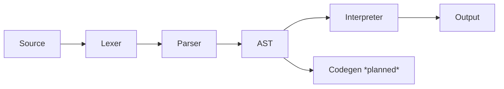

# MiniC Compiler & Compiler Design Laboratory Suite


[](https://opensource.org/licenses/MIT)
[]()
[]()

A comprehensive compiler development project featuring both a basic Mini-C compiler and all 7 compiler design laboratory experiments as per Anna University curriculum.


## Project Overview

- **Type**: Educational Compiler Suite + Laboratory Experiments
- **Language**: C, WIN_FLEX, WIN_BIOSN, Assembly
- **Architecture**: Multi-phase compiler construction
- **Goal**: Complete understanding of compiler internals through practical implementation

##  Compiler Design Laboratory (Complete Suite)

| Experiment | Title | Technologies | Status |
|------------|-------|--------------|--------|
| 1 | Lexical Analyzer for C Patterns | LEX, C | ✅ Complete |
| 2 | LEX Tool Implementation | LEX, C | ✅ Complete |
| 3 | YACC Specifications | YACC, LEX, C | ✅ Complete |
| 4 | Three Address Code Generation | LEX, YACC, C | ✅ Complete |
| 5 | Type Checking System | LEX, YACC, C | ✅ Complete |
| 6 | Code Optimization Techniques | LEX, YACC, C | ✅ Complete |
| 7 | 8086 Assembly Backend | LEX, YACC, Assembly | ✅ Complete |

**Location**: All experiments are in `/experiments/` folder

---

## 🏗️ MiniC Compiler (Original Project)

## Current Phase

- [x] Lexer: Full tokenization with position tracking 
- [x] Parser: Recursive descent with operator precedence
- [x] AST: Visualizable tree structure
- [x] Interpreter: Complete runtime evaluation
- [x] Semantic Analysis: Variable declaration checks 
- [x] Error Handling: Improve syntax/runtime messages with line and column context Display source location in case of parse or runtime errors
- [ ] Type System (optional): Add support for `int`, `string`, and type checks  
- [ ] Codegen (optional): Generate assembly or bytecode for executio

🔧 **Recent Improvements**:
- Robust error handling system
- Relational operators (`<`, `<=`, `>`, `>=`, `==`, `!=`)
- Memory-safe string management
- Debug logging system

## Architecture



## Features

### Lexer
  - Supports keywords: `int`, `let`, `print`
  - Identifiers, numeric literals
  - Operators: `+`, `-`, `*`, `/`, `=`,`==`, `!=`, `<`, `<=`, `>`,`>=`
  - Delimiters: `(`, `)`, `;`
  - Enhanced whitespace skipping and file-reading
  - Classifies `let` as `TOKEN_LET

---

### Syntax Analysis
```text
program     → statement*
statement   → decl | assign | print
decl        → 'let' ID '=' expr ';'
expr        → equality
equality    → comparison ( ('=='|'!=') comparison )*
comparison  → term ( ('<'|'<='|'>'|'>=') term )*
term        → factor ( ('+'|'-') factor )*
factor      → unary ( ('*'|'/') unary )*
unary       → ('-'|'+') unary | primary
primary     → NUM | ID | '(' expr ')'
```

---

### AST Generation + Debug Printer
  - Node Types:
    - `VarDecl`, `Assign`, `Print`
    - `BinaryOp`, `UnaryOp`, `Literal`, `Variable`
  -  UTF-8 visual tree printing with `print_ast()`

⚠️ To see tree-style AST properly, use a UTF-8 compatible terminal like:
- Windows Terminal
- VSCode integrated terminal
- Git Bash (mintty)
- Any Linux terminal (gnome-terminal, Konsole, etc.)

If your terminal shows `Γö£` or junk characters, it's a rendering issue, not a bug.

---

### Evaluator / Interpreter
- Evaluates AST in a simple runtime
- Tracks variable values with error checks
- Detects runtime issues:
  - undefined variables
  - Division by zero

---

### Semantic Analysis

- Verifies:
  - No use of undeclared variables
  - Valid assignments and usage
- Catches common runtime issues early

---

## Output
```text
Token: let          Lexeme: let        Value: 0
Token: identifier   Lexeme: x          Value: 0
Token: =            Lexeme: =          Value: 0
Token: number       Lexeme: 2          Value: 2
Token: +            Lexeme: +          Value: 0
Token: number       Lexeme: 3          Value: 3
Token: *            Lexeme: *          Value: 0
Token: (            Lexeme: (          Value: 0
Token: number       Lexeme: 4          Value: 4
Token: -            Lexeme: -          Value: 0
Token: number       Lexeme: 1          Value: 1
Token: )            Lexeme: )          Value: 0
Token: ;            Lexeme: ;          Value: 0
Token: print        Lexeme: print      Value: 0
Token: (            Lexeme: (          Value: 0
Token: identifier   Lexeme: x          Value: 0
Token: )            Lexeme: )          Value: 0
Token: ;            Lexeme: ;          Value: 0
Token: identifier   Lexeme: x          Value: 0
Token: =            Lexeme: =          Value: 0
Token: identifier   Lexeme: x          Value: 0
Token: +            Lexeme: +          Value: 0
Token: number       Lexeme: 5          Value: 5
Token: ;            Lexeme: ;          Value: 0
Token: print        Lexeme: print      Value: 0
Token: (            Lexeme: (          Value: 0
Token: identifier   Lexeme: x          Value: 0
Token: )            Lexeme: )          Value: 0
Token: ;            Lexeme: ;          Value: 0
Token: print        Lexeme: print      Value: 0
Token: (            Lexeme: (          Value: 0
Token: -            Lexeme: -          Value: 0
Token: identifier   Lexeme: x          Value: 0
Token: )            Lexeme: )          Value: 0
Token: ;            Lexeme: ;          Value: 0
Token: EOF          Lexeme: EOF        Value: 0
[DEBUG][PARSER] Created binary op node, op = 5
[DEBUG][PARSER] Created binary op node, op = 6
[DEBUG][PARSER] Created binary op node, op = 4
Created var decl node for x

AST:
AST:
├── VarDecl x
│   └── BinaryOp(+)
│       ├── Literal 2
│       └── BinaryOp(*)
│           ├── Literal 3
│           └── BinaryOp(-)
│               ├── Literal 4
│               └── Literal 1
├── Print
│   └── Variable x
├── Assign x
│   └── UnaryOp(+)
│       └── Literal 5
├── Print
│   └── Variable x
└── Print
    └── UnaryOp(-)
        └── Variable x

Output:
Starting interpretation...
Current node type: 0
Processing declaration of x
Evaluating expression type 3
Evaluating binary op: 4
Evaluating expression type 4
Evaluating expression type 3
Evaluating binary op: 6
Evaluating expression type 4
Evaluating expression type 3
Evaluating binary op: 5
Evaluating expression type 4
Evaluating expression type 4
Setting variable x to 11
Current node type: 2
Evaluating expression type 5
0
Current node type: 1
Evaluating expression type 6
Evaluating expression type 4
Setting variable x to 5
Current node type: 2
Evaluating expression type 5
5
Current node type: 2
Evaluating expression type 6
Evaluating expression type 5
-5
Interpretation completed successfully.
```

## Planned  Work

- [ ] **Type System (optional)**  
  - Add support for basic types like `string`, and possibly type checking

- [ ] **Code Generation (optional)**  
  - Generate pseudo-assembly or VM bytecode for portability or optimization

- [ ] **Control Flow**  
  - Support if, while, block {}

---

## working

```bash
git clone https://github.com/Gappyjosuke/minic-compiler.git
cd minic-compiler
make
./minic test/error.minic
```
---

## For Laboratory Experiments:

```bash
git clone https://github.com/Gappyjosuke/minic-compiler.git
cd experiments/1-lexical-analyzer
run the appropitae .exe's for each experiments
```

## Project Structure
```text
minic-compiler/
├── src/                    # Original MiniC compiler source
├── experiments/            # All 7 laboratory experiments
│   ├── 1-lexical-analyzer/
│   ├── 2-lex-tool-implementation/
│   ├── 3-yacc-specifications/
│   ├── 4-three-address-code/
│   ├── 5-type-checking/
│   ├── 6-code-optimization/
│   └── 7-backend-8086/
├── docs/                   # Documentation
├── test/                   # Test cases
└── README.md
```
## Project Evolution
    
    2023: Basic MiniC Compiler foundation

    2024: Complete 7-experiment compiler laboratory suite

    Future: Enhanced MiniC features + experiment extensions

# License
MIT License - See LICENSE for details.